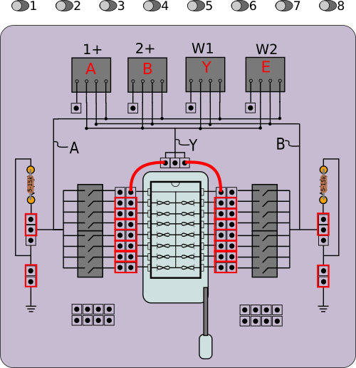
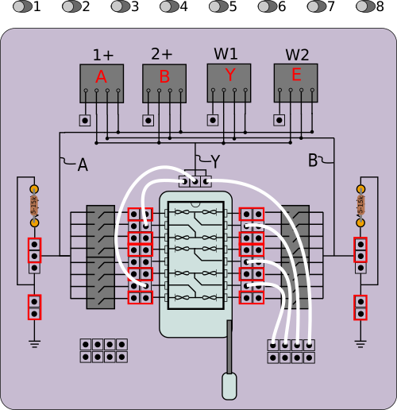

# BoardCheck Experiment

This app allows you to self-test the functionality of your board and memristor chips. Paramount to accurate measurement is validated equipment. This app enables you to check the functionality of:

1. Bilateral Switches via **Switch Board Test** Button 
2. 1-4 Muxes  via **1-4 Mux Board Test** Button 
3. Knowm Discrete Memristor chips. via **Mem-Inline Chip** Button 

## Switch Board Test

This test activates each switch in order and applies a pulse across the chip and a series resistor. The voltage drop across the series resistor, V(B), is used to calculate the resistance across the A B circuit nodes. Higher series resistors (1-40kΩ or higher) should be used. 5kΩ precision resistors should be placed across each of the terminals of the DIP socket, otherwise the test will always fail.

The test is passed if resistance for each switch selection is withen 2% tolerance of 5kΩ, and the resistance when all switches are closed is above 1MΩ.

## 1-4 Mux Board Test

This test allow for the test of each of the 1-4 muxes. It does this by routing a voltage of a specific value to each of the three junctions while also routing the oscilloscopes. If any of the tests fail, it is reported and the whole test will fail. The measured voltage is compared to the generated voltage for each route and oscilloscope channel and the deviation is shown.

## Mem-Inline Chip

This test applies a sequence of pulses across each memristor, using the voltage drop across the series resistor to measure the memristor resistance. The sequence is as follows:

1. Write
2. Reset 
3. Read-->R0
4. Write
5. Read-->R1
6. Reset
7. Read-->R2

Default Constants:

V_READ = .1f;
V_WRITE = 1.5f;
V_RESET = -1.5f;

MEMINLINE_MIN_Q = 2;
MEMINLINE_MIN_R = 10;//kΩ
MEMINLINE_MAX_R = 100;//kΩ
MEMINLINE_MIN_SWITCH_OFF = 1000;//kΩ

Define Values: 

q1 = R0 / R1;
q2 = R2 / R1;

Test will terminate if the measured resistance with all switches off is less than MEMINLINE_MIN_SWITCH_OFF. This condition indicates that the switches are bad and thus measurement if futile. 

A memristor will fail the test if any of the following conditions are found:

R0 < MEMINLINE_MIN_R && R1 < MEMINLINE_MIN_R && R2 < MEMINLINE_MIN_R
                  
R0 > MEMINLINE_MAX_R && R1 > MEMINLINE_MAX_R && R2 > MEMINLINE_MAX_R        
          
q1 < MEMINLINE_MIN_Q
          
q2 < MEMINLINE_MIN_Q

# 1-2 X 7 AHaH Node Chip Test

This test applies a sequence of pulses one the 'Y' node and measures the response at nodes 'A' and 'B' to determine if the memristors in the chip are functional, just like the Mem-Inline Chip.

Board must be configured as follows:

# 1-2 & 1-2i Synapase Chip Test

This test applies a sequence of pulses one the 'Y' node and measures the response at nodes 'A' and 'B' to determine if the memristors in the chip are functional, just like the Mem-Inline Chip.

Board must be configured as follows:

## Preferences

The preferences window allows you to save your preferred experimental control parameters between sessions of using the app.
